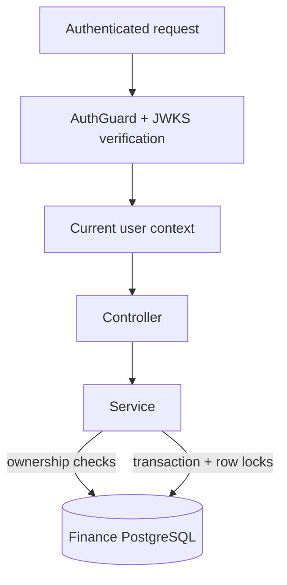

# be-node-ts

The **finance domain API** for FinTrack: accounts, categories, and transactions, with user-scoped access and safe balance updates.


Part of [FinTrack Labs](https://github.com/fintrack-labs), a personal learning project on distributed backend design.

## Highlights

- **Stateless token verification.** Validates RS256 bearer tokens locally against the auth service's **JWKS** (cached); no per-request call to auth.
- **User-scoped by design.** The `userId` comes from the verified JWT subject, and every account, category, and transaction query is filtered by it.
- **Concurrency-safe money movement.** Creating transactions and changing balances run inside database transactions with **pessimistic row locks**. Transfers update both accounts atomically.
- **Audit and soft delete** through shared base entities and subscribers.
- **Consistent pagination:** `{ data, page, limit, totalItems, pageCount }`.

## Domain model

| Entity | Notes |
| --- | --- |
| Account | Owned by a user; balance, currency, type, and a version column |
| Category | System-wide or user-owned; supports parent/child hierarchy |
| Transaction | Expense, income, transfer, or balance adjustment; optional account, category, and receipt metadata |

## API

Base path: `/api/v1` (port `8080`). All routes except health require `Authorization: Bearer <access token>`.

| Resource | Path |
| --- | --- |
| Health | `/health` |
| Accounts | `/accounts` |
| Categories | `/categories` |
| Transactions | `/transactions` |

A ready-to-run collection is in [`be-api-client-test`](https://github.com/fintrack-labs/be-api-client-test).

## Request flow



## Tech stack

Node.js · TypeScript · NestJS (Fastify adapter) · TypeORM · PostgreSQL

## Getting started

Prerequisites: Node.js (LTS), PostgreSQL, and a running [`be-auth-ts`](https://github.com/fintrack-labs/be-auth-ts) (for the JWKS endpoint).

```bash
git clone https://github.com/fintrack-labs/be-node-ts.git
cd be-node-ts
npm install
cp .env.example .env      # database settings and the auth JWKS URL
npm run start:dev
```

<!-- TODO: samakan perintah & nama variabel dengan package.json dan .env.example -->

## Known limitations & roadmap

- Explicitly enforce **issuer, audience, and algorithm** when verifying JWTs.
- Verify foreign-key constraints and category ownership rules at both database and service layers.
- Add dependency/readiness checks (database, JWKS) beyond the basic health endpoint.
- Add dashboard analytics (a first read model) to replace mock data in the frontend.
- Publish a versioned OpenAPI contract to prevent DTO drift with the frontend and OCR service.

## Related repositories

[`fe-web`](https://github.com/fintrack-labs/fe-web) · [`be-auth-ts`](https://github.com/fintrack-labs/be-auth-ts) · [`be-ai-ocr-service`](https://github.com/fintrack-labs/be-ai-ocr-service) · [`be-api-client-test`](https://github.com/fintrack-labs/be-api-client-test)
